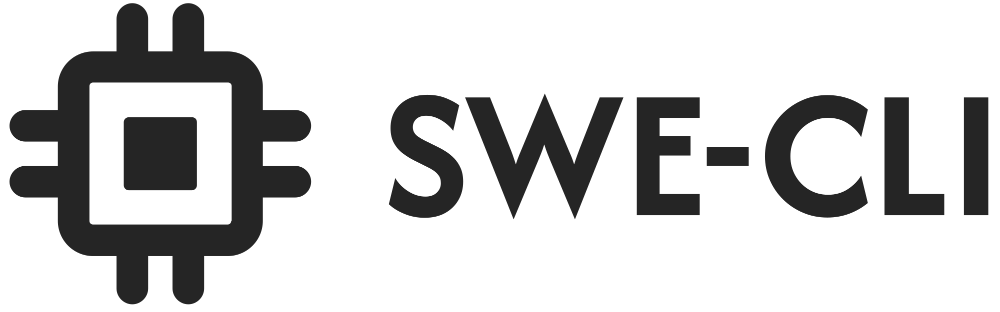

<p align="center">
  
</p>

<h1 align="center">SWE-CLI</h1>


<p align="center">
One-Stop, Cost-Effective CLI-based Coding Agent for Modern Software Engineering
</p>

<p align="center">
  <a href="https://pypi.org/project/swe-cli/"></a>
  <a href="https://python.org/"></a>
  <a href="./LICENSE"></a>
  <a href="https://github.com/swe-cli/swe-cli/stargazers"></a>
</p>

<p align="center">
  <a href="#-quick-start"><strong>Quick Start</strong></a> •
  <a href="#-demo"><strong>Demo</strong></a> •
  <a href="#-features"><strong>Features</strong></a> •
  <a href="#-architecture"><strong>Architecture</strong></a> •
  <a href="https://modelcontextprotocol.io/"><strong>MCP</strong></a>
</p>

<!-- ---

### 🎬 Demo

<p align="center">
  
</p>

<p align="center">
  <em>Interactive coding assistant in action</em>
</p> -->

<!-- --- -->

## 📖 Overview

**SWE-CLI** is a one-stop coding agent that interacts with users through a powerful command-line interface. Created with the goal to **democratize how coding agents are built, designed, and optimized**, SWE-CLI aims to be comparable to state-of-the-art CLI tools on the market while remaining **fully open-source** and bringing substantial benefits to the developer community.

We support standard features such as **MCP (Model Context Protocol) integration**, **shell command execution**, **session and context management**, and **multi-provider LLM support**. Beyond these foundations, we plan to deliver unique capabilities including:

- **GitHub Issue Resolution**: Automated issue fixing following state-of-the-art scaffolds like SWE-Agent, Agentless, and HyperAgent
- **Intelligent Code Understanding**: LSP-powered codebase analysis for accurate context-aware assistance
- **Sub-Agent Architecture**: Specialized agents for different coding tasks (testing, refactoring, documentation)
- **CI/CD Integration**: Seamless connection with GitHub workflows for automated development pipelines
- **Paper2Code & Text2Web**: Advanced code generation from research papers and natural language specifications

Built on **SOLID principles** with **dependency injection** and **interface-driven design**, SWE-CLI serves not only as a powerful development tool but also as an educational resource for understanding modern agentic system architecture.

## ✨ Features

### ✅ Ready Features
- **Interactive Coding Agent that Understand Codebase**
- **Multi-Provider LLM Support** (Fireworks, OpenAI, and Anthropic via native HTTP clients)
- **Basic Access to Shell Commands and Control Them Through LLMs**
- **Context Management**
- **Compact Context Automatically**
- **Session Management**
- **MCP Support**
- **Switch between Plan Mode and Normal Mode**

### 🔄 In-Progress
- **LSP for Accurate Codebase Understanding**
- **Github Issues Resolve** (across scaffolds: SWE-Agent, Agentless, HyperAgent)
- **UI Management**
- **Coding Rules**

### 📋 In-Plan
- **Sub-Agents**
- **Connect with Github CI/CD workflows**
- **Paper2Code**
- **Text2Web**
- **CodeWiki Integration**

---

## 🚀 Quick Start

### Installation

**pip**
```bash
pip install swe-cli
```

**macOS (Homebrew)**
```bash
brew install swe-cli
```

**From source**
```bash
git clone https://github.com/swe-cli/swe-cli.git
cd swe-cli
pip install -e .
```

### Usage

Run `swecli` to start the interactive coding assistant:

```bash
swecli
```

Configure your settings in `~/.swecli/settings.json`:

```json
{
  "provider": "fireworks",
  "api_key": "your-api-key-here",
  "model": "accounts/fireworks/models/llama-v3p1-70b-instruct"
}
```

For more details, see the [documentation](./docs).

### Provider Support

SWE-CLI ships with first-class support for the following providers:

- **Fireworks** – OpenAI-compatible chat completions endpoint
- **OpenAI** – standard Chat Completions API
- **Anthropic** – native Messages API adapter with tool-use support

Select the provider via `model_provider` (`fireworks`, `openai`, or `anthropic`) and supply the corresponding API key through environment variables or config.

---

## ⚙️ Configuration

SWE-CLI uses JSON configuration with environment variable support:

**Example** (`config-fireworks-sample.json`):

```json
{
  "providers": {
    "fireworks": {
      "api_key": "$FIREWORKS_API_KEY",
      "default_model": "accounts/fireworks/models/llama-v3p1-70b-instruct"
    }
  },
  "experimental": {
    "use_pydantic_ai": false
  },
  "permissions": {
    "skip_requests": true
  }
}
```

**Key Configuration Options**:
- `providers` - LLM provider configurations (Anthropic, OpenAI, Fireworks)
- `experimental.use_pydantic_ai` - Enable PydanticAI engine (Phase 1 complete)
- `permissions.skip_requests` - Skip tool approval prompts

---

## 🏗️ Architecture

<div align="center">

### 📁 Project Structure

</div>

```
src/swecli/
├── ui/                      # User Interface Layer (SOLID-refactored)
│   ├── chat_engine.py       # Main orchestrator
│   ├── interfaces.py        # Service abstractions
│   ├── services/            # SOLID-compliant services
│   └── main_ui.py           # UI entry point
├── llm/                     # LLM Integration
│   ├── providers/           # Provider implementations
│   ├── manager.py           # Multi-provider orchestration
│   └── base.py              # Base classes and types
├── tools/                   # Tool System
│   ├── filesystem.py        # File operations
│   ├── shell.py             # Shell execution
│   ├── search.py            # Code search
│   ├── edit.py              # File editing
│   └── registry.py          # Tool registry
├── pydantic_ai/             # PydanticAI Integration (Experimental)
│   └── adapter.py           # PydanticAI chat engine
└── config/                  # Configuration Management
    ├── models.py            # Pydantic models
    └── loader.py            # Config loading
```

### 🎯 Design Principles

<table align="center" width="80%">
<tr>
<td align="center" width="25%">
<h4>🎨 SOLID</h4>
<p>Clean, maintainable code following SOLID principles</p>
</td>
<td align="center" width="25%">
<h4>🔌 Interface-Driven</h4>
<p>Loose coupling through interface abstractions</p>
</td>
<td align="center" width="25%">
<h4>💉 Dependency Injection</h4>
<p>Services injected into ChatEngine</p>
</td>
<td align="center" width="25%">
<h4>🧩 Service-Oriented</h4>
<p>Modular services with clear responsibilities</p>
</td>
</tr>
</table>

---

## 📄 License

<div align="center">

**MIT License**

Copyright (c) 2025 SWE-CLI Contributors

</div>
